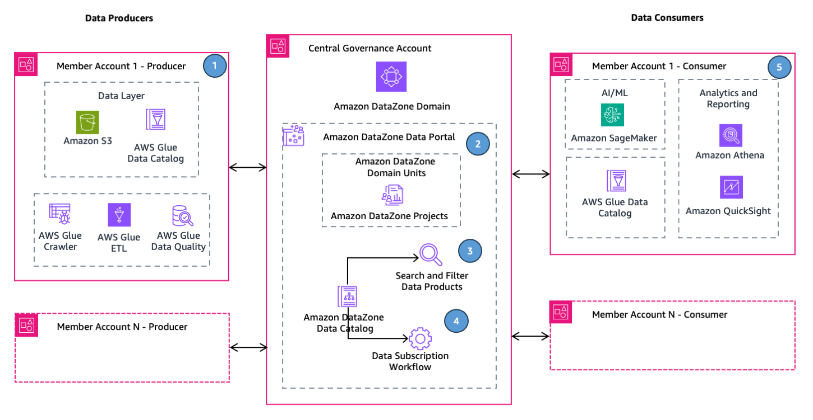

# Building an enterprise Data Mesh with Amazon DataZone, Amazon DataZone, AWS CDK, and AWS CloudFormation

## Content

  - [Content](#content)
  - [Overview](#overview)
  - [Target Audience](#target-audience)
  - [Key Features](#key-features)
  - [Architecture](#architecture)
  - [Repository Structure](#repository-structure)
  - [Getting Started](#getting-started)
    - [Prerequisites](#prerequisites)
    - [Deploy Solution](#deploy-solution)
    - [Clean Up](#clean-up)
 - [Security](#security)
 - [License](#license)
 - [Feedback](#feedback)


## Overview

This repository contains the AWS CDK and AWS CloudFormation infrastructure to build an enterprise data mesh with Amazon DataZone. The data mesh is a decentralized organizational and data management framework that aims to improve data accessibility, quality, and governance across the organization. See this AWS prescriptive guidance for more details: [Build an enterprise data mesh with Amazon DataZone, AWS CDK, and AWS CloudFormation](https://docs.aws.amazon.com/prescriptive-guidance/latest/patterns/build-enterprise-data-mesh-amazon-data-zone.html). 

## Target Audience

The target audience of this solution are data engineers, cloud engineers, cloud architects, and DevOps engineers.

## Key Features

The key features of the solution are: 


1. **Data Governance Framework**: The solution enables the implementation of data governance guardrails. For example, by enabling the management of Amazon DataZone glossaries and metadata forms, the solution ensures consistency of business metadata in your organization.
2. **Streamlined Project and User Management**: The solution helps create Amazon DataZone projects and provides an easy way to assign users to their corresponding Amazon DataZone project(s). This simplifies access management and facilitates collaboration across business units of your organization.
3. **Configuration-Driven Environment Setup**: The solution offers a configuration-driven approach to create Amazon DataZone resources, such as Amazon DataZone projects, environments, glossaries, and metadata forms. This allows for flexible and scalable deployment of project-specific resources and configurations.
4. **Seamless Onboarding of New Member Accounts**: The solution simplifies the onboarding process for new member accounts (producers and consumers) across the organization, enabling easy integration of new AWS accounts into the data mesh.
5. **Notifications and Auditing**: The solution enables notifications and auditing capabilities, allowing organizations to monitor data access, utilization, and other critical events. This promotes transparency, compliance, and effective data governance.


## Architecture

The following diagram displays the data mesh reference architecture based on Amazon DataZone using Amazon S3 and AWS Glue Data Catalog as data source.



## Repository Structure

```bash
.
├── CODE_OF_CONDUCT.md
├── CONTRIBUTING.md
├── LICENSE
├── README.md
├── bin
│   └── app.ts
├── cdk.json
├── config
│   └── Config.ts
├── docs
├── lib
│   ├── DzDataMesh*.ts
│   ├── cfn-templates
│   └── utils
├── package.json
├── requirements.txt
├── src
│   ├── lambda-functions
│   └── lambda-layers
└── tsconfig.json
```


## Getting Started


### Prerequisites
* Minimum two active Amazon Web Services (AWS) accounts. One for the Central Governance account and another for the member account. You’ll need AWS Administrator credentials for the Central Governance account on your development environment.

* AWS Command Line Interface (CLI) to manage your AWS services from the command line. Install the AWS CLI by following the instructions in the AWS documentation (https://aws.amazon.com/cli/).

* Node.js and Node Package Manager (npm) to manage AWS CDK applications. Download and install the latest version of Node.js from the official website.

* AWS CDK Toolkit to synthesize and deploy AWS CDK applications. Install it globally using npm.

```bash
npm install -g aws-cdk
```

* Python is installed in your development environment. This solution supports python version 3.12.

* TypeScript is installed in your development environment. Install it globally using npm compiler.

```bash
npm install -g typescript
```
* Docker is installed in your development environment.


### Deploy Solution

This section describes the steps to deploy the data mesh-based data solution.  

#### 1. Set up development environment

This step provides instructions to set up your development environment. Ensure that the prerequisites are met, before proceeding with this step. 

See [Set up environment](docs/set_up_environment.md) for more details.

#### 2. Deploy resources in the Central Governance Account

The Central Governance Account hosts the Amazon DataZone domain and the Amazon DataZone data portal. The Amazon DataZone data portal plays a key role in facilitating the data mesh architecture, enabling producers to publish data assets and consumers to discover and subscribe to those assets.

In the Central Governance Account, the following resources are deployed:

1. **Amazon DataZone Domain**: The Amazon DataZone domain helps you organize data assets, users, environments and projects in your organization.

2. **Amazon DataZone data portal**: The Amazon DataZone data portal is a browser-based web application where you can catalog, discover, govern, share, and analyze data in a self-service manner. 

3. **Amazon DataZone Admin Projects and Environments**: The Amazon DataZone Admin projects and environments are deployed in the Central Governance Account. This solution uses Data Lake blueprint to create the Amazon DataZone environment.

4. **Amazon DataZone Metadata Forms and Glossaries**: The Amazon DataZone Metadata Forms and Glossaries are deployed in the Central Governance Account. They serve as a centralized repository for metadata of the data assets from various projects, enriched with business context, metadata, tags, and classifications.

5. **AWS IAM Roles for Data Users**: The solution deploys AWS IAM roles corresponding to data users of the data mesh. The solution can be extended to SSO users.

6. **Resource Monitoring and User Notification**: The solution helps monitor the cloud resources of the data mesh solution. It notifies users on successful member account association. 


See [Deploy resources in the Central Governance Account](docs/deploy_to_central_gov.md) for more details.


#### 3. Onboard new member account

The data mesh solution based on Amazon DataZone supports organizations to onboard new member accounts as their data mesh grows or as new business units or partners join the ecosystem. The solution provides a streamlined approach to onboard these new member accounts onto the data mesh.

Here's how the solution facilitates easy onboarding of new member accounts:

1. **Configuration-Driven Approach**: The solution uses a configuration-driven approach, where the details of new member accounts can be added to a centralized configuration file to run the deployement.

2. **Automated Account Registration**: Once the new member account details are added to the configuration file, the solution automates association of the account to the Amazon DataZone domain. 

3. **Amazon DataZone Member Projects and Environments**: The solution deploys the Amazon DataZone projects and environments linked to the member accounts. It uses data lake blueprint to create the Amazon DataZone environment.

See [Onboard new member account](docs/onboard_member_account.md) for more details.


### Clean Up

Clean up the solution using the following steps.

See [Clean up](docs/clean_up.md) for more details.


## Security

See [CONTRIBUTING](CONTRIBUTING.md#security-issue-notifications) for more information.

## License

This library is licensed under the MIT-0 License. See the LICENSE file.

## Feedback 

Have an issue? Please create an issue in [the GitHub repository](https://github.com/aws-samples/data-mesh-datazone-cdk-cloudformation/issues/new)


